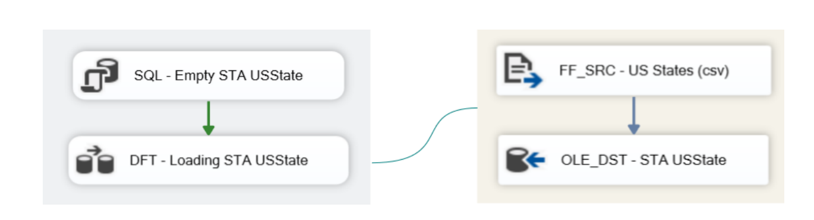

# ETL & Data Warehouse Project for ServiceSpot

## Introduction

ServiceSpot, an IT company, approached us with a request to help them analyze their call center data. They were receiving daily calls from their customers but were unable to effectively utilize the data due to it being spread across multiple files. Our mission was to develop an ETL project using SSIS (SQL Server Integration Services) to load the data into a new enterprise data warehouse. Our focus was on providing well-organized data for business analysis and reporting.

## 1. Data Warehouse Design

Our first step was to analyze the source data and identify the most effective schema for our data warehouse. We determined that a star schema would be the most suitable design because it simplifies joins, enhances business analysis, and optimizes report performance. Below are the details:

1. **CallType Dimension**: Allows analysis based on different call types, such as volume by type, performance metrics, and trends.
2. **Date Dimension**: Facilitates time-based analysis, including patterns, trends over time, and seasonal variations.
3. **Employee Dimension**: Enables analysis at the employee level, such as performance evaluations and team analysis.
4. **CallData Fact Table**: Central table capturing call-related metrics, with keys referencing dimension tables for analysis.

## 2. STA Loading the Data Source Tables

In this phase, we loaded data from the source tables into our SAT database using a consistent workflow. We read the flat source files for `CallCharge`, `CallType`, `Employee`, and `US State`, then loaded the extracted data into the STA Database with the OLE DB Destination component. A SQL Task was used to empty tables before execution to avoid duplicate data.

**Note:** For the `CallCharge` file, we retained empty rows as null values and addressed them during the ODS phase. To load the `CallData` files from 2018, 2019, and 2020, we implemented a loop within the SSIS package to iterate through each file.

First, we created a variable named "varFilePath" to store the path of the CallData folder, ensuring dynamic referencing within the SSIS package. Then, we implemented a Foreach Loop container which allowed us to iterate through all the files within the folder.

Within this loop, we used the Flat File Source component to read the CSV files, and the OLE DB Destination component to load the extracted data into the STA table.

## 3. ODS Data Transformation with SSIS

We performed various tasks to cleanse and structure the data:

### 3.1 Employee Table Workflow
- Extracted data from the STA database.
- Split the "Site" column into City and StateCD.
- Retrieved StateName and Region information from the USState table.
- Resized columns and loaded the transformed data into the ODS Database.

### 3.2 Call Type Table Workflow
- Extracted data from the STA database.
- Resized columns and loaded the transformed data into the ODS Database.

### 3.3 Call Charge Table Workflow
- Extracted data from the STA database.
- Excluded null records using a Condition Split Transformation.
- Performed an unpivot operation for separate columns (CallType, Year, Charge).
- Cleaned and converted Charge data type, and trimmed empty spaces in labels.

### 3.4 Call Data Table Workflow
- Extracted data from the STA Call Data table.
- Split the `CallTimeStamp` column into `CallDate` and `CallTime`.
- Changed data types for consistency and integrated charge information.
- Modified the datatype of CallTime to "time"
- Adjusted the datatypes of CallDuration, WaitTime, and CallAbandoned to integer and boolean, respectively.
- To incorporate the charge information, we retrieved it from the ODS CallCharge table. After resizing the columns as necessary, we loaded the transformed data into the ODS Database.

## 4. Loading the Data into the Data Warehouse

The data warehouse consists of three dimension tables (`DimDate`, `DimEmployee`, `DimCallType`) and one fact table (`FactCallData`). We used a Slowly Changing Dimension (SCD) Type 1 approach to handle changes in dimension attributes.

### 4.1 Dimension Date
Created a Date table in the DWH database using an SQL script.

### 4.2 Dimension CallType
- Created an empty table in the DWH database with the same columns as the ODS CallType table. However, in the DWH table, we added a technical key that would serve as a link to the Fact Table.
- Extracted the data from the ODS CallType table using an OLE DB source component.
- Implemented a lookup transformation  to verify the existence of the `CallTypeID` in our DWH table.
  - If the CallTypeID did not exist, we inserted the corresponding row into the dimension table.
  - If the row already existed, we employed another lookup component to determine if any attributes had changed.
    - In the case of attribute changes, we updated the table accordingly.

  

### 4.3 Dimension Employee
Similar steps as the CallType dimension but using `EmployeeID` for checks.

### 4.4 Fact Table CallData
- Extracted data and performed referential integrity checks.
- Stored unmatched records separately while retaining information in the fact table.

## 5. Packages Scheduler

We implemented a scheduler package to automate the workflow for the STA, ODS, and DWH databases in their designated order.
