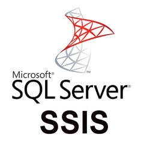

# ETL Projects Repository

Welcome to the ETL Projects Repository! This repository contains a collection of ETL projects developed for various school assignments and real-life scenarios encountered during my work as a Data Analyst.

## Table of Contents 

- [Introduction](#introduction)
- [Tools](#tools)
- [Projects](#projects)
- [Contact](#contact)

## Introduction

This repository serves as a comprehensive resource for ETL projects that can be used for educational purposes, practice, and real-world data integration tasks. Each project is documented to provide a clear understanding of the ETL processes involved, including data extraction, transformation, and loading techniques.

## Tools
<table>
<tr>
<td></td>
<td></td>
<td></td>
</tr>
</table>

## Projects

1. **ETL & Data Warehouse Project for ServiceSpot**
   - Industry: IT & Customer Service
   - Description: Developed an ETL process to load call center data into an enterprise data warehouse using SSIS. The project included data cleansing, transformation, and loading into a star schema.
   - Tools: SSIS, SQL Server
   - Project File: [Link to project documentation](Project_1_ETL_Data_Warehouse_for_ServiceSpot.md)

## Contact

If you have any questions or would like to discuss my work further, feel free to reach out:

- [LinkedIn](https://www.linkedin.com/in/misszeferino/)

Thank you for visiting my repository, and I hope you find these projects helpful!
